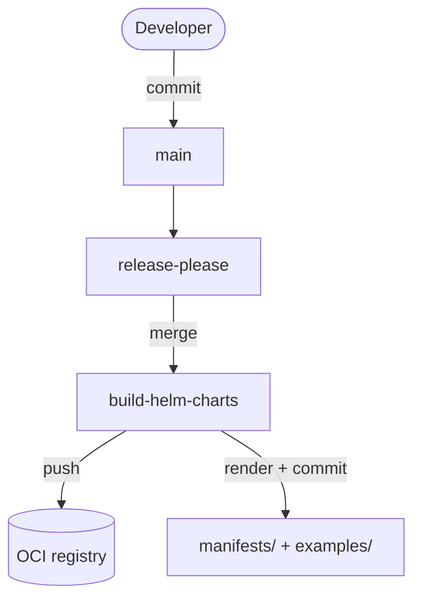
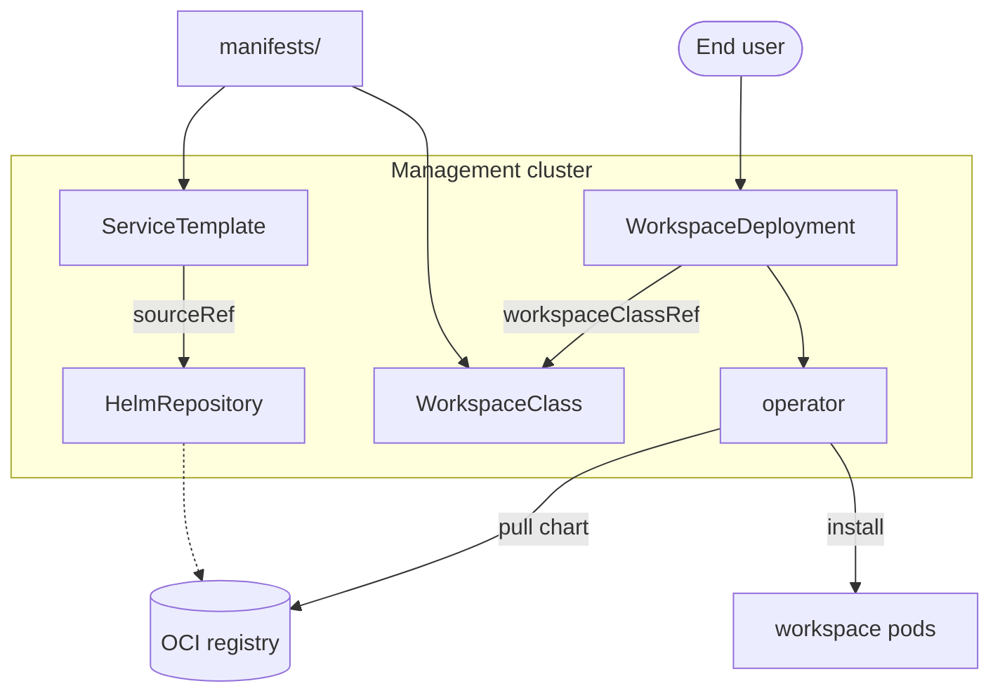

# Adding a workspace template

A *workspace template* is the versioned unit a workspace type ships as: a Helm
chart (deployed to **child** clusters) bundled with the operator CRs that make it
selectable on the **management** cluster — its `ServiceTemplate` and
`WorkspaceClass` — plus an example `WorkspaceDeployment`. Chart and CRs version
and release together.

The fastest path is to copy [`workspace-templates/jupyter-notebook/`](../workspace-templates/jupyter-notebook)
(chart + `exalsius/` + `values-*.yaml`), adapt it, then follow the steps below.

---

## How it flows

A template produces three things, kept distinct: the **chart** (runs the
workspace pods on child clusters), the **ServiceTemplate + WorkspaceClass** (make
it selectable on the management cluster), and they share **one** OCI registry and
**one** `HelmRepository` source — there is no repo-per-template. Charts and CRs
are versioned **per chart** and released together.

### Authoring → release → publish (when `manifests/` are created)



| Node | What it is |
|---|---|
| **Developer** | edits the chart + `exalsius/` templates; commits `feat/fix(<name>): …` to `main` |
| **release-please** | opens a per-chart release PR that bumps `Chart.yaml` + writes the CHANGELOG |
| **build-helm-charts** | on a new version: `helm push` the chart to OCI (immutable — skips if the version exists), then render the CRs |
| **OCI registry** | `ghcr.io/exalsius/exalsius-workspace-hub/charts/<name>:<ver>` — one registry, one artifact per chart+version |
| **manifests/ + examples/** | generated, version-pinned `ServiceTemplate` + `WorkspaceClass` (+ example WSD), committed back to the repo |

### Deploy / runtime (how a workspace gets deployed)



| Node | What it is |
|---|---|
| **manifests/** | the generated `ServiceTemplate` + `WorkspaceClass` for a version, applied to the management cluster (transport handled separately) |
| **HelmRepository** | single source `exalsius-workspace-hub`; resolves *all* charts from the OCI registry |
| **ServiceTemplate** `<name>-<ver>` | wraps exactly one chart version (via `sourceRef` → HelmRepository → OCI) |
| **WorkspaceClass** `<name>-<ver>` | catalog entry a `WorkspaceDeployment` pins by `workspaceClassRef` |
| **WorkspaceDeployment** | end-user intent to run a workspace |
| **operator** | reads the class, creates a ServiceSet → Sveltos pulls the chart and installs it |
| **workspace pods** | run on the **child** cluster behind a ClusterIP Service (operator-owned routing) |

`manifests/` and `examples/` are **generated** — never hand-edited. Edit the
`exalsius/` templates; CI re-renders them on the next version.

---

## 1. Author the chart — `workspace-templates/<name>/`

A normal Helm chart, but it must conform to the operator contract (this is what
makes it a *workspace* template rather than just a chart):

- **Name resources off `.Release.Name`.** The operator sets the release name to
  `wsd-<clusterdeployment>-<workspace>`.
- **Consume operator-injected resources**, with chart-local fallbacks so a plain
  `helm install` still works:
  - `_exalsius.resources.perReplica.{cpu,memory,storage}` → container
    requests/limits and PVC size
  - `_exalsius.resources.replicas` → replica count (or pin to `1` for a
    single-instance workspace)
- **GPU, vendor-agnostic** — never hardcode `nvidia.com/gpu`:
  - request the GPU via `_exalsius.resources.perReplica.{gpuResourceName,gpuCount}`
    (only when `gpuCount > 0`)
  - apply `_exalsius.scheduling.nodeSelector` **verbatim** as the pod nodeSelector
  - gate any `runtimeClassName` on `_exalsius.resources.perReplica.gpuVendor`
    (e.g. set it only for NVIDIA)
- **Expose a ClusterIP Service** named `{{ .Release.Name }}-<endpoint>`
  (e.g. `{{ .Release.Name }}-http`). **No NodePort, Ingress, or LoadBalancer** —
  routing is operator-owned.
- **`values.schema.json`** (if present) must admit the injected `_exalsius`
  object, or it will reject the operator's values. Keep it strict elsewhere.
- Add **`values-nvidia.yaml` / `values-amd.yaml` / `values-cpu.yaml`** that
  simulate the injection; CI renders the chart against each (the per-accelerator
  matrix).

Set `version` in `Chart.yaml` (start in `0.x` while the chart is stabilizing; cut
`1.0.0` once the contract is stable). **Omit `appVersion`** — the image is pinned
independently (below), so an `appVersion` that tracks the chart would only mislead.

**Pin the image by an explicit, immutable reference, decoupled from the chart
version** ([ADR 0001](adr/0001-decouple-workspace-image-tag-from-chart-version.md)).
Images are built in a separate repo on their own cadence, so never derive the tag
from `.Chart.AppVersion`. Model it as `image.{repository,tag,digest}` and render
`repository:tag@digest`. Immutability comes from the `@sha256:<digest>`, not the
tag: a bare moving tag (`:latest`, `:latest-nvidia`) is forbidden, but
`:latest@sha256:<digest>` is fine — the digest pins it, the tag is just a label.

## 2. Add the operator CRs — `workspace-templates/<name>/exalsius/`

Three **templated** files. The placeholders `${VERSION}` and `${VERSION_DASHED}`
(dots → dashes, for DNS-1123 names) are substituted at render time by
[`scripts/render-workspace-manifests.sh`](../scripts/render-workspace-manifests.sh) —
do not hand-edit version numbers.

- **`servicetemplate.yaml`** — `name: <name>-${VERSION_DASHED}`;
  `spec.helm.chartSpec.{chart: <name>, version: "${VERSION}"}`;
  `sourceRef: {kind: HelmRepository, name: exalsius-workspace-hub}`.
  > Do **not** add `sourceRef.namespace` — k0rdent's ServiceTemplate schema
  > rejects it. The HelmRepository must be in the same namespace (`kcm-system`).
- **`workspaceclass.yaml`** — `name: <name>-${VERSION_DASHED}`; its
  `serviceTemplate.name` points at the ServiceTemplate above. Declares
  `defaultResources`, `accessEndpoints`, and `userFacingConfig`.
  > `accessEndpoints[].name`/`port` must match the chart's Service
  > (`<release>-<endpoint>`), or routing won't find the backend.
  > Do **not** set `gpuType`/`gpuNodeSelector` here — they are per-deployment,
  > cluster-dependent choices and the operator rejects them on a class.
- **`example-workspacedeployment.yaml`** — pins
  `workspaceClassRef: <name>-${VERSION_DASHED}` and carries the chart-specific
  `spec.values` (these values are also reused by the local dev harness).

## 3. Register it for versioning

In [`release-please-config.json`](../release-please-config.json) add a package
entry for `workspace-templates/<name>` (component `<name>`, `extra-files` bumping
`Chart.yaml` `$.version`), and seed its current version in
[`.release-please-manifest.json`](../.release-please-manifest.json). This gives
the chart per-chart SemVer, tags (`<name>-vX.Y.Z`), and immutable OCI publishing.

## 4. Test locally

With the [`local-dev-env`](https://github.com/exalsius/local-dev-env) running
(`make up` + `make setup-kcm-regional-child`) and the operator built from your
branch:

```sh
make dev-up CHART=<name> IMAGE_TAG=<pullable-tag>
# edit chart …
make dev-redeploy CHART=<name> IMAGE_TAG=<pullable-tag>

# GPU branches (kind has no real GPUs — fake one):
make dev-fake-gpu VENDOR=nvidia
make dev-up CHART=<name> GPU=1 VENDOR=nvidia
make dev-unfake-gpu VENDOR=nvidia

make dev-down CHART=<name>
```

See [`scripts/dev/README.md`](../scripts/dev/README.md) for the full harness
(including the access/curl recipe). The harness rejects a chart with no
`exalsius/` directory — step 2 is what makes it deployable. For quick offline
render checks without a cluster:

```sh
helm template t workspace-templates/<name> -f workspace-templates/<name>/values-nvidia.yaml
```

## 5. Release

Commit with a conventional, chart-scoped message, e.g.
`feat(<name>): add workspace template`. On merge to `main`:

1. release-please opens a per-chart release PR.
2. Merging it bumps the chart's `Chart.yaml`.
3. `build-helm-charts` publishes the new (immutable) chart version to OCI and
   renders `manifests/<name>/<version>/` + `examples/<name>/<version>/`.
4. The rendered `manifests/<name>/<version>/` (ServiceTemplate + WorkspaceClass)
   is applied to the management cluster (delivery mechanism handled separately).

A `WorkspaceDeployment` pins an exact `WorkspaceClass` version, so upgrade and
rollback are explicit edits of `workspaceClassRef`; old versions remain available.

## Mental model & common mistakes

- **Two artifacts, one unit.** The chart runs on *child* clusters; the
  ServiceTemplate + WorkspaceClass live on the *management* cluster. They version
  and ship together.
- **`exalsius/` files are templates** — never hand-stamp versions; let the render
  script do it.
- **`accessEndpoints` ↔ Service name must agree** (`<release>-<endpoint>`).
- **No `sourceRef.namespace`** in the ServiceTemplate.
- **The default image must be real and pullable**; use `IMAGE_TAG=` in the
  harness until it is published.
- **The image is pinned by digest, decoupled from the chart version** — don't
  derive `image.tag` from `.Chart.AppVersion`, and don't add `appVersion`
  ([ADR 0001](adr/0001-decouple-workspace-image-tag-from-chart-version.md)).
- **Generated trees** (`manifests/`, `examples/`) are not edited by hand — change
  the `exalsius/` templates and re-render.
