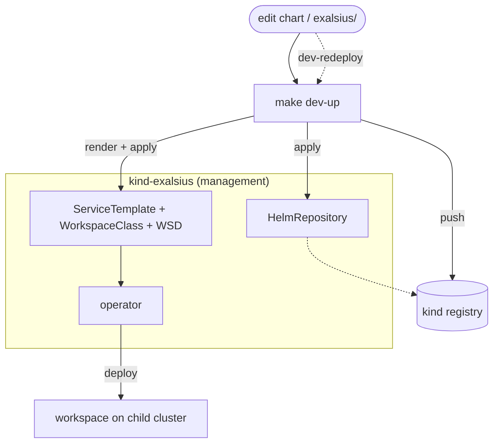

# Local chart-iteration harness

Iterate on a workspace chart **and its operator CRs** against the local-dev-env
kind clusters, through the real operator path (HelmRepository → ServiceTemplate →
WorkspaceClass → WorkspaceDeployment). For pure render checks without a cluster,
use `helm template` with the chart's `values-*.yaml` instead.

## Prerequisites

From the [`local-dev-env`](../../../local-dev-env) repo:

```sh
make up                       # kind mgmt cluster, k0rdent, operator, source-controller
make setup-kcm-regional-child # regional + 2 child clusters, Gateway API CRDs
```

The operator must be built from the branch you want to test (set
`components.exalsius-operator.source.local` in `local-dev-env/config/components.yaml`).

## Usage

```sh
make dev-up                         # package+push the chart, deploy ST/WSC/WSD (CPU)
make dev-redeploy                   # after editing the chart: re-push + recreate WSD
make dev-down                       # remove WSD/WSC/ServiceTemplate/HelmRepository
make dev-publish-prereq PREREQ=...  # push a prereq chart + apply ONLY its ServiceTemplate
```

Watch it:

```sh
kubectl --context kind-exalsius -n kcm-system get wsd dev -w
kubectl --context kind-child-adopted-1 -n ws-dev get deploy,pod,svc,pvc
```

## How it works



| Node / edge | What it is |
|---|---|
| **make dev-up** | packages + pushes the chart, applies the local HelmRepository, renders `exalsius/`, applies ServiceTemplate + WorkspaceClass + WorkspaceDeployment |
| **kind registry** | `localhost:5050` (push) / `kind-registry:5000` (in-cluster), plain-HTTP |
| **HelmRepository** | local `exalsius-workspace-hub` pointing at the kind registry — same name as prod, different URL |
| **operator** | pulls the chart and installs it into `ws-<name>` on the child cluster |
| **dev-redeploy** | fast loop: re-push + reconcile the HelmRepository + recreate the WSD |

It mirrors the production flow, but against the local kind registry instead of GHCR:

- Packages the chart and pushes it to the local kind registry
  (`oci://localhost:5050/charts`, plain-HTTP).
- Applies a `HelmRepository` named **`exalsius-workspace-hub`** pointing at the
  in-cluster registry — the same name the committed ServiceTemplates use, so they
  work unchanged locally and in prod (only the URL differs). No `flux` CLI needed.
- Renders the chart's `exalsius/` templates **on the fly** at the current
  `Chart.yaml` version (so ServiceTemplate/WorkspaceClass edits are tested too)
  and applies them.
- Builds the WorkspaceDeployment by patching the chart's
  `exalsius/example-workspacedeployment.yaml`: it reuses the example's
  chart-specific `spec.values` (e.g. `notebookPassword`) but sets the
  topology (cluster/namespace/class) and GPU/image from the flags.
- `dev-redeploy` re-pushes, pokes the `HelmRepository` to re-pull
  (`reconcile.fluxcd.io/requestedAt`), and recreates the WSD for a deterministic
  redeploy (the local registry tag is mutable, unlike prod OCI).

## Single chart

The harness is per-chart: `make dev-up CHART=<name>` works for any chart that
ships an `exalsius/` directory (ServiceTemplate + WorkspaceClass + example WSD).
Charts without it are rejected with a clear message. `CHART` may be a nested
path (e.g. `CHART=llm-inference/llm-d-model`).

## llm-inference (multi-chart + prerequisite)

`llm-inference` is two charts: `llm-d-model` (one model) declares `llm-d-infra`
(shared agentgateway + model discovery + Open WebUI) as a **prerequisite**, which
the operator auto-installs once per `ClusterDeployment` and reuses across models
([ADR-0002](../../docs/adr/0002-llm-inference-prerequisite-and-umbrella-mapping.md)).
Two harness details follow:

- **The model's WorkspaceClass pins the exact infra version.** `render_and_apply_crs`
  resolves `${INFRA_VERSION[_DASHED]}` from the sibling `llm-d-infra/Chart.yaml`
  when rendering the model's CRs (same resolution as `render-workspace-manifests.sh`).
- **The prerequisite must exist before the model deploys.** `dev-publish-prereq`
  pushes the infra chart and applies its `ServiceTemplate` so the operator can
  auto-install it. Infra is a **pure prerequisite** — it ships no WorkspaceClass,
  so there is nothing else to deploy and no class-vs-prerequisite double-install to
  guard against ([ADR-0006](../../docs/adr/0006-open-webui-routed-per-model-not-via-infra-class.md)).
  Open WebUI is routed per model via each model's `chat` endpoint.

The inference-stack CRDs (GAIE + agentgateway) are **not** on the clusters; they
ship in `llm-d-infra/crds/` ([ADR-0004](../../docs/adr/0004-inference-crds-vendored-in-llm-d-infra.md))
and land when the operator installs the prerequisite.

The model's example WSD ships a **CPU vLLM simulator** (`llm-d-inference-sim` +
a `uds-tokenizer` sidecar), so it serves a real OpenAI-compatible endpoint with
no GPU hardware — the model pod's `gpuCount` only satisfies the operator gate, so
still fake a GPU:

```sh
make dev-fake-gpu VENDOR=nvidia
make dev-publish-prereq PREREQ=llm-inference/llm-d-infra
make dev-up CHART=llm-inference/llm-d-model GPU=1
```

Inspect it:

```sh
# prereq auto-installed + reused, then the per-model endpoint federated:
kubectl --context kind-exalsius -n kcm-system get wsd dev -o yaml | yq '.status.prerequisites, .status.access'
# routing: the model's http Service + HTTPRoutes + its InferencePool
kubectl --context kind-child-adopted-1 -n ws-dev get svc,httproute,inferencepool,pod
# a real completion through the model's http endpoint (port 8000):
kubectl --context kind-child-adopted-1 -n ws-dev exec deploy/... -- \
  curl -s localhost:8000/v1/models
```

Routing note: `llm-d-model` exposes two HTTP AccessEndpoints, each backed by an
in-namespace redirect Service. `http`/8000 (`<release>-http`) redirects (setting
an `X-Gateway-Model-Name` header) to the shared `llm-d-inference-gateway` in
`default`, which routes by the header to this model's `InferencePool`. `chat`/80
(`<release>-chat`) redirects to the shared gateway's `webui` listener (:8081),
which forwards to the single shared `llm-d-open-webui` Service — via the gateway,
not Open WebUI directly, because the per-model redirect rides the ambient waypoint,
which only reaches mesh-native upstreams like the gateway. Open WebUI is routed per
model because the infra prerequisite owns no class
([ADR-0006](../../docs/adr/0006-open-webui-routed-per-model-not-via-infra-class.md)).

## GPU paths (NVIDIA / AMD)

kind has no real GPUs, and the operator's gate requires a node that matches the
selector **and** advertises allocatable `*/gpu`. The single example WSD covers
both CPU and GPU: the harness synthesizes the GPU selector from `VENDOR`, and
`dev-fake-gpu` uses the same label, so they match by construction.

```sh
make dev-fake-gpu VENDOR=nvidia     # label node + patch status allocatable nvidia.com/gpu=1
make dev-up GPU=1 VENDOR=nvidia IMAGE_REPO=srnbckr/devpod IMAGE_TAG=latest   # WSD selecting that node
```

Swap `VENDOR=amd` to exercise the ROCm branch (selector `amd.com/gpu.device-id=74a1`,
resource `amd.com/gpu`, no runtimeClass).

**Verify selection actually happened** — the operator should have matched the
selector, resolved the offering, and injected GPU placement into the chart:

```sh
# rendered pod on the child cluster:
kubectl --context kind-child-adopted-1 -n ws-dev get pod -o yaml | \
  yq '.items[0].spec | {nodeSelector, runtimeClassName, limits: .containers[0].resources.limits}'
# nvidia -> nodeSelector{nvidia.com/gpu.product: NVIDIA-L40}, runtimeClassName: nvidia, limits{nvidia.com/gpu: "1"}
# amd    -> nodeSelector{amd.com/gpu.device-id: 74a1},        no runtimeClassName, limits{amd.com/gpu: "1"}
```

**Negative test** — selection must *reject* an unavailable GPU. Run the same
deploy WITHOUT faking first; the WSD should go Failed:

```sh
make dev-up GPU=1 VENDOR=nvidia      # on an un-faked cluster
kubectl --context kind-exalsius -n kcm-system get wsd dev \
  -o jsonpath='{.status.phase} {.status.message}'   # -> Failed  No GPU matching ...
```

**Inventory** — after faking, the faked offering should appear in the Colony's
GPU inventory with the same selector you'd put in a real WSD:

```sh
kubectl --context kind-exalsius -n kcm-system get colony default \
  -o jsonpath='{.status.gpuInventory}' | jq
```

Cleanup:

```sh
make dev-down
make dev-unfake-gpu VENDOR=nvidia
```

This validates selection, gating, injection, and scheduling onto the GPU node —
everything except real GPU *execution*, which kind can't do.

## Variables

| Var | Default | Meaning |
|-----|---------|---------|
| `CHART` | `jupyter-notebook` | chart dir under `workspace-templates/` |
| `MGMT` | `kind-exalsius` | management cluster context |
| `CHILD_CTX` | `kind-child-adopted-1` | child cluster context (for GPU faking) |
| `CD` | `default-child-adopted-1` | target ClusterDeployment name |
| `NS` | `kcm-system` | namespace for ST/WSC/WSD |
| `WSD_NAME` | `dev` | WorkspaceDeployment name |
| `GPU` / `VENDOR` | `0` / `nvidia` | request a GPU; vendor for fake + selector |
| `IMAGE_REPO` / `IMAGE_TAG` | (chart default) | override the workspace image |
| `PREREQ` | (none) | `publish-prereq` only: chart dir to publish as a prerequisite |

> GPU-workspace charts pin their image by digest and select it by vendor
> (`image.default` for NVIDIA/CPU, `image.amd` for AMD — ADR-0003). The
> override targets the variant the run will use (`image.amd` only when
> `GPU=1 VENDOR=amd`, else `image.default`), clears that variant's pinned digest,
> and forces `Always` pull. Pass `IMAGE_REPO`/`IMAGE_TAG` until a real digest is
> published, e.g. `IMAGE_REPO=srnbckr/devpod IMAGE_TAG=latest`.
